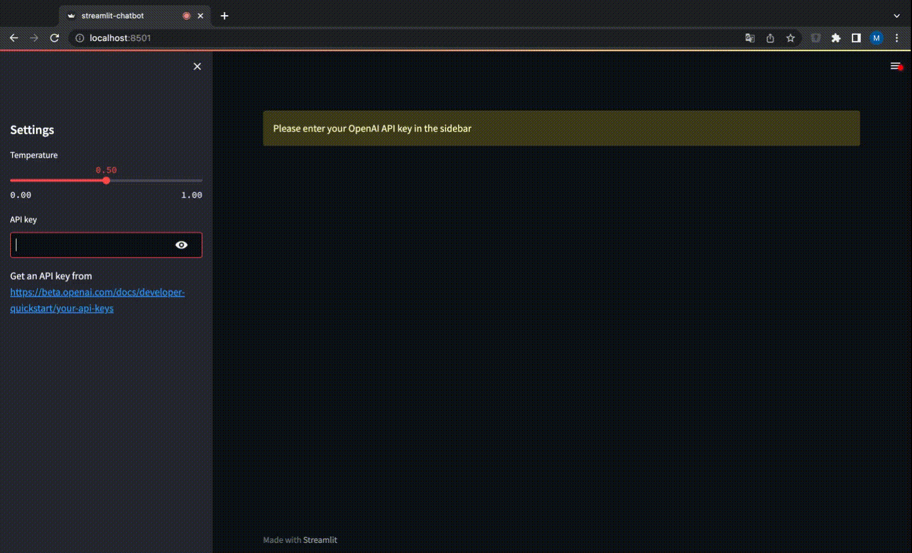

# streamlit-chatbot
This repository provides a simple web app for playing around the OpenAI chat completion API. 

## Local Setup
1. Clone this repository
2. Install the dependencies with `pip install -r requirements.txt`
3. Start the web app with `streamlit run src/app.py`

## App Usage
1. Enter your OpenAI API key
2. Start a conversation with the chatbot
3. (Optional) Change the temperature to observe how it affects the chatbot's responses

## Demo

